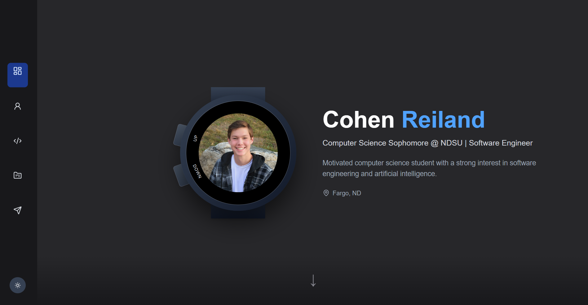

# Personal Portfolio

A modern, responsive portfolio website built with Next.js and React, featuring dark/light theme support, Strava API integration, and smooth animations.

## Features

- **Theme Toggle**: Persistent dark and light mode with smooth color transitions
- **Strava Integration**: Running statistics fetched from Strava API with real-time data
- **Responsive Design**: Fully responsive layout optimized for mobile and desktop viewing
- **Custom Components**: Animated smartwatch display, running stats dashboard, and gradient section transitions
- **Project Showcase**: Featured projects with live links, screenshots, and technology tags
- **Contact Integration**: Direct email with copy-to-clipboard, GitHub, and LinkedIn links

## Demo

[](https://cohen-reiland.vercel.app/)

## Tech Stack

- Next.js 16.1.1
- React 19.2.3
- TypeScript 5.9.3
- Tailwind CSS 4.1.18
- Framer Motion 12.24.10
- Lucide React (icons)
- Strava API

## Getting Started

### Prerequisites
- Node.js 20.9.0 or higher
- npm, yarn, pnpm, or bun
- Strava API credentials (optional for running stats)

### Setup

1. Clone the repository
2. Install dependencies:
```bash
npm install
```
3. Create a `.env.local` file for Strava integration (optional):
```env
STRAVA_CLIENT_ID=your_client_id
STRAVA_CLIENT_SECRET=your_client_secret
STRAVA_REFRESH_TOKEN=your_refresh_token
```
4. Run the development server:
```bash
npm run dev
```
5. Open [http://localhost:3000](http://localhost:3000) in your browser

### Build for Production

```bash
npm run build
npm start
```

## Usage

Navigate through sections with smooth scrolling:
- **Hero**: Introduction with animated smartwatch component
- **About**: Personal background with live Strava running statistics
- **Skills**: Programming languages, frameworks, and current learning
- **Projects**: Featured projects with GitHub links and technology stacks
- **Contact**: Direct links to email, GitHub, and LinkedIn

Theme preference persists across sessions. Running stats refresh hourly via Strava API.

## Project Structure

```
├── app/
│   ├── api/strava/
│   ├── layout.tsx
│   ├── page.tsx
│   └── globals.css
├── components/
│   ├── about/
│   ├── watch/
│   ├── Navbar.tsx
│   └── ThemeProvider.tsx
└── public/
```

## Deployment

Deployed on Vercel at [cohen-reiland.vercel.app](https://cohen-reiland.vercel.app/)

## License

MIT License - See [LICENSE](LICENSE) for details

## Author

Cohen Reiland  
Computer Science Sophomore  
North Dakota State University
